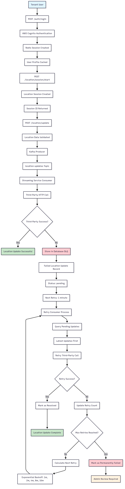

# Go Multi-Tenant System

A scalable multi-tenant microservices architecture built with Go, featuring real-time location tracking, data streaming, and robust failure handling with Dead Letter Queue (DLQ) retry mechanisms.

## Architecture

- **API Gateway**: Central entry point with authentication and routing
- **Auth Service**: User authentication using AWS Cognito with Redis session management
- **Tenant Service**: Multi-tenant management and data isolation
- **Location Service**: Real-time location data collection and processing
- **Streaming Service**: Data streaming to third-party systems via Kafka
- **Retry Consumer**: Handles failed location updates with intelligent retry strategies

## Technology Stack

- **Backend**: Go (Gin framework)
- **Database**: PostgreSQL with multi-tenant schema and Row-Level Security (RLS)
- **Authentication**: AWS Cognito with Redis-based session management
- **Cache**: Redis for session caching and user profiles
- **Message Broker**: Apache Kafka for asynchronous processing
- **Failure Handling**: Database-backed DLQ with exponential backoff retry
- **Containerization**: Docker & Docker Compose

## Quick Start

1. **Clone the repository**:
   ```bash
   git clone https://github.com/pavitra93/go-multi-tenant-system.git
   cd go-multi-tenant-system
   ```

2. **Set up environment variables**:
   ```bash
   cp env.example .env
   # Edit .env with your AWS Cognito and database credentials
   ```

3. **Start the services**:
   ```bash
   docker-compose up -d
   ```

4. **Access the API**:
   - API Gateway: http://localhost:8080
   - Auth Service: http://localhost:8001
   - Tenant Service: http://localhost:8002
   - Location Service: http://localhost:8003
   - Streaming Service: http://localhost:8004
   - Retry Consumer: http://localhost:8085

## API Endpoints

### Authentication
- `POST /auth/login` - User login (creates Redis session)
- `POST /auth/register` - User registration
- `POST /auth/logout` - User logout (revokes Redis session)
- `GET /auth/sessions` - Get user sessions
- `DELETE /auth/sessions/{id}` - Revoke specific session

### Tenant Management
- `GET /tenants` - List tenants (admin only)
- `POST /tenants` - Create new tenant (admin only)
- `GET /tenants/{id}` - Get tenant details
- `PUT /tenants/{id}` - Update tenant
- `GET /tenants/{id}/users` - Get tenant users
- `POST /tenants/{id}/users` - Add user to tenant
- `PUT /tenants/{id}/users/{user_id}` - Update tenant user
- `DELETE /tenants/{id}/users/{user_id}` - Remove user from tenant

### Location Tracking
- `POST /location/session/start` - Start location tracking session
- `POST /location/update` - Submit location data (streams to Kafka)
- `GET /location/session/{id}` - Get session data
- `POST /location/session/{id}/stop` - Stop tracking session
- `GET /location/sessions` - Get user's location sessions
- `GET /location/session/{id}/locations` - Get location history for session

### Streaming & Monitoring
- `GET /streaming/health` - Streaming service health check
- `GET /retry/stats` - Retry statistics (admin only)

## Key Features

### Multi-Tenant Data Isolation
- **Tenant ID**: Every database record includes a `tenant_id` field
- **Row-Level Security**: Database-level isolation using PostgreSQL RLS
- **Redis Sessions**: User profiles cached with tenant context
- **Separate Admin Table**: Platform administrators isolated from tenant users

### Authentication & Session Management
- **AWS Cognito Integration**: Secure user authentication
- **Redis-Based Sessions**: Fast session lookup with user profiles
- **Token Hashing**: SHA256 hash of access tokens as Redis keys
- **Session Management**: Multiple sessions per user with individual revocation

### Real-Time Location Tracking
- **10-Minute Sessions**: Organized location data collection
- **Kafka Streaming**: Asynchronous processing of location updates
- **Worker Pool**: Efficient Kafka message production with backpressure
- **Database Indexing**: Optimized queries for location data

### Failure Handling & Retry
- **Database DLQ**: Failed location updates stored for retry
- **Exponential Backoff**: 1m, 2m, 4m, 8m, 16m retry intervals
- **Priority Processing**: Latest location updates retried first
- **Max Retries**: 8 attempts before permanent failure
- **Status Tracking**: pending → retried → resolved/permanently_failed
- **Session Validation**: Only retries updates for active sessions
- **Smart Filtering**: Inactive sessions marked as permanently failed

## Complete Flow: Tenant User Location Tracking with DLQ

### 1. User Authentication Flow
```
User Login → AWS Cognito → Access Token → Redis Session → User Profile Cached
```

### 2. Location Tracking Flow
```
Start Session → Location Updates → Kafka → Streaming Service → Third-Party
```

### 3. Failure Handling Flow
```
Third-Party Fails → Database DLQ → Retry Consumer → Session Validation → Exponential Backoff → Success/Failure
```

### 4. Detailed Flow Chart



*Complete flow from tenant user authentication to location update with robust retry mechanism for third-party service calls*

### 5. Retry Strategy Details

#### Exponential Backoff Timeline
```
Failure → 1m → 2m → 4m → 8m → 16m → 32m → 64m → 128m → Permanently Failed
```

#### Status Flow
```
pending → retried → resolved
pending → retried → permanently_failed
pending → permanently_failed (inactive session)
```

#### Priority Processing
- Latest location updates are retried first (`ORDER BY created_at DESC`)
- Ensures most current location data reaches third-party systems
- Critical for real-time location tracking use cases

#### Session Validation
- **Active Session Check**: Validates session status before retry
- **Smart Filtering**: Inactive sessions (ended/expired/cancelled) marked as permanently failed
- **Resource Optimization**: Prevents unnecessary retries for inactive sessions
- **Status Tracking**: Clear distinction between retry failures and session inactivity

### 6. Database Schema

#### Failed Location Updates Table
```sql
CREATE TABLE failed_location_updates (
    id UUID PRIMARY KEY,
    original_event_id VARCHAR(255) NOT NULL,
    tenant_id UUID NOT NULL,
    user_id VARCHAR(255) NOT NULL,
    session_id UUID,
    latitude DOUBLE PRECISION,
    longitude DOUBLE PRECISION,
    error_message TEXT NOT NULL,
    retry_count INTEGER DEFAULT 0,
    status VARCHAR(50) DEFAULT 'pending',
    next_retry_at TIMESTAMP,
    created_at TIMESTAMP DEFAULT CURRENT_TIMESTAMP,
    updated_at TIMESTAMP DEFAULT CURRENT_TIMESTAMP,
    resolved_at TIMESTAMP
);
```

### 7. Performance Optimizations

#### Database Indexes
- `idx_failed_location_updates_retry_lookup` - Optimized retry queries
- `idx_failed_location_updates_status` - Status-based filtering
- `idx_failed_location_updates_created_at` - Priority ordering

#### Kafka Configuration
- Worker pool for message production
- Batch processing for efficiency
- Backpressure handling for high load

#### Redis Session Management
- Token hashing for security
- TTL-based session expiration
- Fast user profile lookup

## Development

### Prerequisites
- Go 1.23+
- Docker and Docker Compose
- AWS Cognito User Pool
- PostgreSQL database
- Apache Kafka
- Redis

### Local Development
1. Set up AWS Cognito User Pool
2. Configure environment variables in `.env`
3. Run database migrations: `001_schema.sql`, `002_indexes.sql`, `003_sample_data.sql`, `004_dlq_schema.sql`
4. Start services: `docker-compose up -d`

### Environment Variables
```bash
# AWS Cognito
AWS_REGION=ap-south-1
COGNITO_USER_POOL_ID=ap-south-1_xxxxxxxxx
COGNITO_CLIENT_ID=xxxxxxxxxxxxxxxxxxxxxxxxxx

# Database
DB_HOST=localhost
DB_PORT=5432
DB_USER=postgres
DB_PASSWORD=password
DB_NAME=multi_tenant_db

# Redis
REDIS_HOST=localhost
REDIS_PORT=6379

# Kafka
KAFKA_BROKER=localhost:9092

# Third-Party
THIRD_PARTY_ENDPOINT=http://httpbin.org/post
```

## License

MIT License